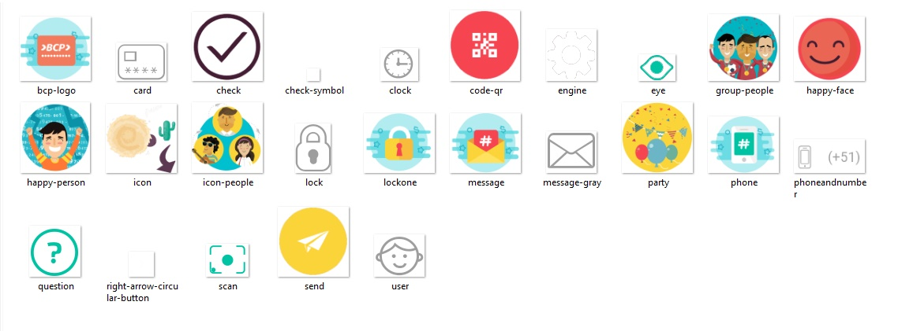

# Yape | BCP

## El proyecto
Se realizó un code review del:
Proyecto final del Sprint 5 del Bootcamp de Laboratoria < l >

- El proyecto se baso en hacer un aplicativo del BCP "Yape", que sirve para realizar envíos de dinero de forma rápida y segura.

## Recursos

## Fuentes consultadas:
- Método post de jQuery: url(https://api.jquery.com/jquery.post/)

## Yape: 

### App en funcionamiento
Así se ven las tres primeras portadas del App. 

## Código:
- El código se basa en trabajar con el patrón de diseño por componentes e interactuar con la api del bcp. Se trabajo en la primera portada el efecto swipe.
- En la segunda portada se debe realizar la validación de que el número ingresado sea un celular de 9 dígitos y que inicie con el dígito 9, además se valida el hacer check en el cuadro de aceptar las condiciones, cuando realiza ambas validaciones se activa el botón de continuar que cambiará de color.

- En la tercera portada se comprueba que el token sea el correcto; para lo cual en la segunda portada ya hay una comunicación con el api y se crea el primer token. en caso no coincidir el token ingresado se autogenerá otro nuevo cada 21 segundos.

## Desarrollado con:

`HTML` `JavaScript` `CSS`  `jQuery`  

##  Créditos
* [Naomi Villanueva](https://github.com/naovillaj)
* [Mery Cardenas](https://github.com/betsiana)
* [Neiza ](https://github.com/Maryleo3007)
* [Karin](https://github.com/lulublondet)
* [Mitch](https://github.com/maiart46rrrrrrr)
* [Stephanie Hiyagon](https://github.com/stephHiyagon)
